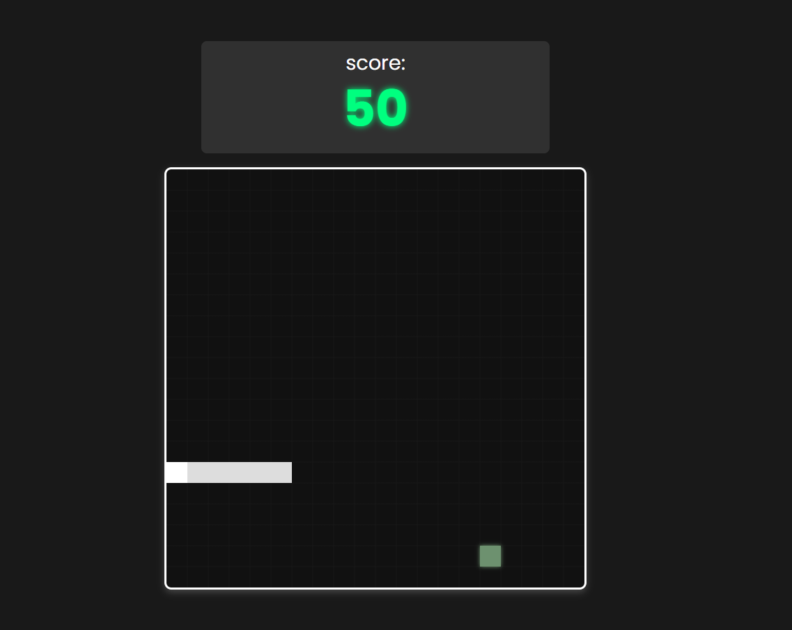

# 🐍 Jogo da Cobrinha - Snake Game

Este é um jogo da cobrinha feito com HTML, CSS e JavaScript puro. Um projeto simples, interativo e nostálgico — ideal para quem quer relembrar os velhos tempos ou estudar lógica de jogos com canvas e eventos de teclado.




## 🎮 Como Jogar

- Use as **setas do teclado** para mover a cobrinha:
  - ⬆️ Cima
  - ⬇️ Baixo
  - ⬅️ Esquerda
  - ➡️ Direita
- O objetivo é comer o máximo de "comida" possível sem bater nas paredes ou em si mesma.

## 🛠️ Tecnologias Utilizadas

- HTML5
- CSS3
- JavaScript (puro, sem frameworks)

## 📁 Como rodar o projeto

1. Clone o repositório:
```bash
git clone https://github.com/NicolasRAlves/Jogo-da-Cobrinha.git
```
2. Acesse a pasta do projeto:
```bash
cd jogo-da-cobrinha
```

### Nicolas Rodrigues Alves

